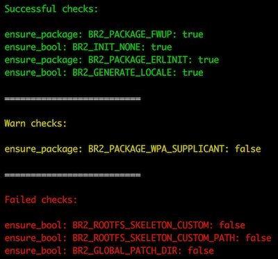

# Nerves.System.Linter

## Installation

```elixir
def deps do
  [
    {:nerves_system_linter, "~> 0.1.0"}
  ]
end
```

## Usage

This package includes a new mix task named `nerves.system.lint` which is dependant on the `NERVES_SYSTEM` environment variable which must be set to a location where a nerves `.config` file is present.  This file is generated after building a nerves system.
```
$ export NERVES_SYSTEM=~/nerves_systems/nerves_system_rpi0/
$ mix nerves.system.lint
```

## Output

After successfully running the linter mix command you will be presented with a report containing three sections



**Successful checks**
These illustrate configurations which are acceptable according to the linter's rules, you will typically want to keep these in place.

**Warn checks**
These illustrate configurations which are typically used but seen to be missing or appear to be set incorrectly according to typical nerves systems and the way they are used in many common systems.

**Failed checks**
This list contains settings which appear to be done incorrectly and have a high probability of generating a system which will not properly support the nerves framework.  Use caution when these checks are present after running the linter.

## Additional Resources

For complete instructions on how to build a custom nerves system reference the [nerves guides](https://hexdocs.pm/nerves/systems.html#customizing-your-own-nerves-system) or the nerves_system_br [README](https://github.com/nerves-project/nerves_system_br/blob/master/README.md).

For more information on how to use buildroot to configure a custom linux distribution, take a look at the [buildroot documentation](https://buildroot.org/docs.html)
